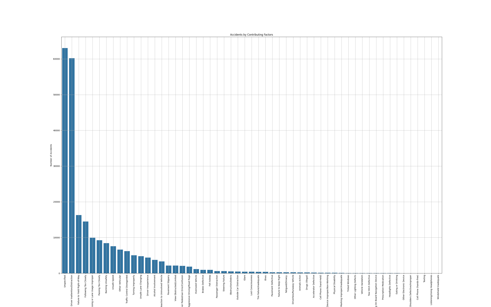
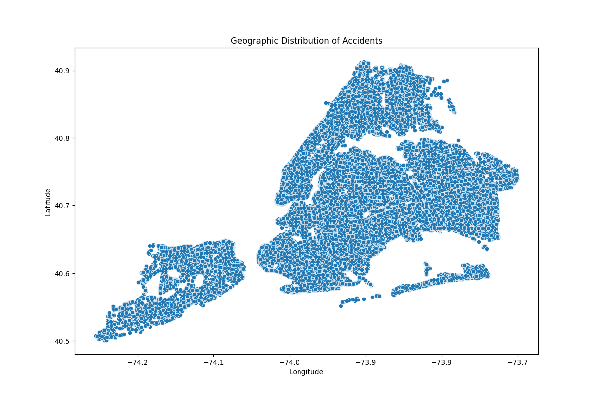
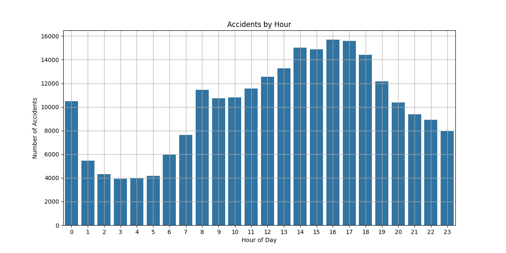
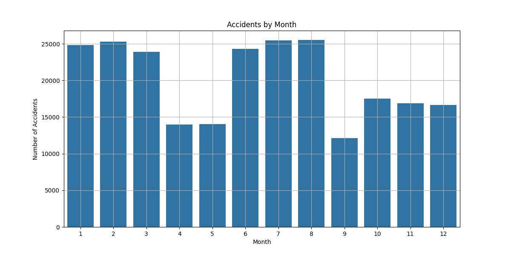
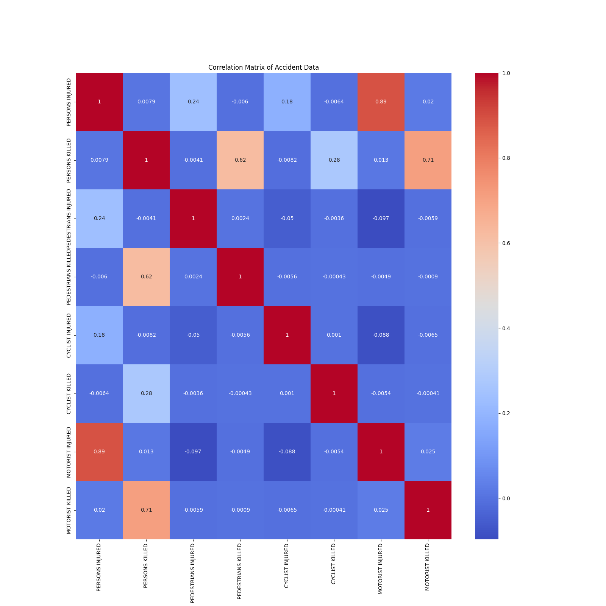
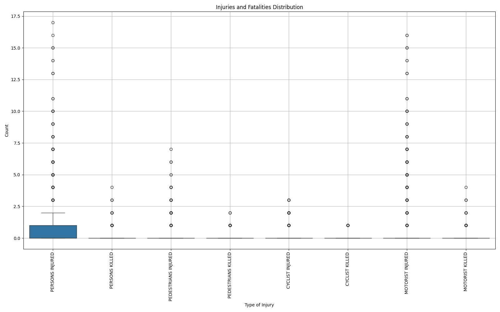

# 机动车碰撞分析与预测

## 简介

通过随机森林回归模型分析和预测机动车碰撞事故中的受伤人数。
分析内容包括数据预处理、碰撞分布和趋势的可视化、模型训练和评估。

## 说明

脚本主要实现了处理和分析纽约市交通事故数据，并训练一个随机森林回归模型来预测交通事故中受伤人数。

1. 首先使用Pandas读取CSV文件，将交通事故数据加载到DataFrame中，将事故日期和时间转换为Pandas的datetime格式，并提取事故发生的小时信息。

2. 检测并删除一些影响预测的数据，对受伤人数列进行异常值处理，将超过三个标准差的值替换为上限或下限。

3. 对数据中的缺失值进行填补，将缺失的城区、邮政编码和事故原因等列填补为相应的默认值。

4. 对分类变量进行独热编码，将城区和事故原因等分类变量转换为数值型特征。

5. 选择需要用于模型训练的特征，包括经纬度、事故发生时间、月份、年份以及独热编码后的分类变量。

6. 使用compute_sample_weight方法计算样本权重，以处理数据的不平衡问题，使用RandomForestRegressor训练模型，并进行预测。

7. 最后可视化了散点图，热力图，时间序列图，堆积柱状图，箱线图，相关性热图。

另外，在本地可以预览accident_heatmap.html热力图

### 数据处理流程



### 数据可视化

#### 散点图



#### 时间序列图（按小时）



#### 时间序列图（按月份）



### 相关性分析



### 箱线图


## 安装

安装依赖：
```bash
pip install -r requirements.txt
